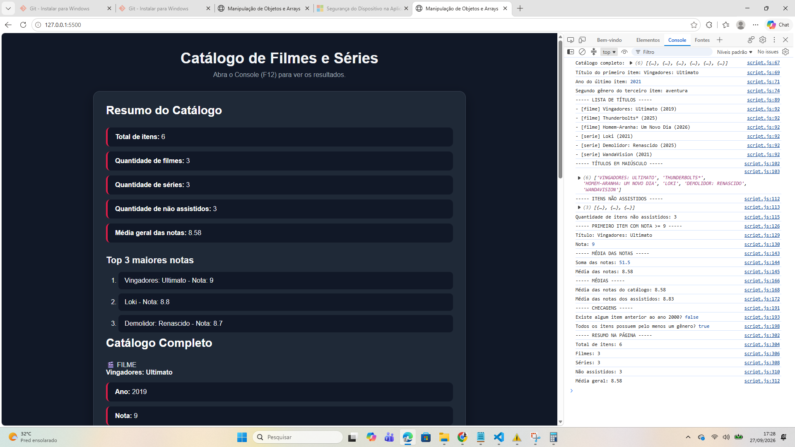
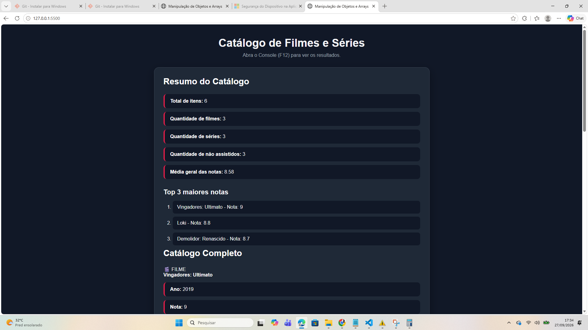

# atv.ptratica.semana.8# Objetos e Arrays (JSON)

Nome: Lucas Leite Silva

Matrícula: 1683948

## 1. Console

Print do Console mostrando os resultados dos processos realizados:

## 2. Página

Print da página mostrando o resumo do catálogo dentro de `#output`:

## 3. Processos realizados

Foram utilizados os seguintes métodos de manipulação de arrays em JavaScript:

- `forEach()` para listar os títulos do catálogo;
- `map()` para transformar os títulos em letras maiúsculas;
- `filter()` para selecionar itens não assistidos;
- `find()` para encontrar o primeiro item com nota maior ou igual a 9;
- `reduce()` para calcular a soma e a média das notas;
- `some()` para verificar se existe algum item anterior ao ano 2000;
- `every()` para verificar se todos os itens possuem pelo menos um gênero.

## 4. Git/GitHub

O projeto foi versionado utilizando Git e enviado para um repositório no GitHub.

Foram realizados os comandos:

- `git add .`
- `git commit`
- `git push`